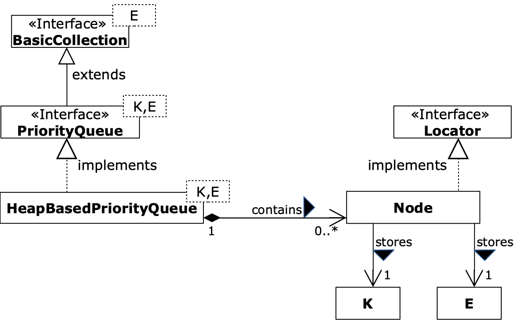

# Priority Queue 


_Note: This exercise belongs to "Block 3: Algorithmen - Aufgabe"
of the module "Project and Training 2". For administrative details, see on Moodle._


You have to implement a generic Priority Queue using a heap which is implemented with an array.

Consider the documentations of the provided interfaces for further specifications. Additionally, there are a lot of test cases (cf. also below) which might help you. 
On Moodle, you find additional slides for more information on heaps, priority queues and especially the concept of bottom-up heap-construction.

Important: You are not allowed to use standard collection classes from the libraries (for example `java.util.ArrayList` etc.), 
but you must implement yourself the data structure based on the idea of a "naive" array.

The points for evaluation are specified below. Fulfilling just the test classes does not necessarily imply that you get all points (cf. below)!

## HeapBasedPriorityQueue

Write a class `ch.bfh.queue.HeapBasedPriorityQueue` that implements the interface `ch.bfh.queue.PriorityQueue`. Your class must use the idea of a heap data structure implemented using an array (thus _not_ a linked binary tree).

Your class must have at least these constructors: 
* `HeapBasedPriorityQueue(Comparator<K> comparator)` a constructor with a comparator as a single parameter which generates a priority queue where the keys are ordered according to the comparator.
* `HeapBasedPriorityQueue(Comparator<K> comparator, List<K> keys, List<E> elements)`  a constructor with three arguments (a list of keys, a corresponding list of elements and a comparator) which generates a priority queue where the keys are ordered according to the comparator. 

The underlying array must be _expendable_, hence when full replaced by an array of double length. Optionally, if the array is filled less than 25%, replace the array by one of half its length (use a minimum of - say - 10 elements of the array for efficiency purposes).

## Usage

The class `ch.bfh.queue.PriorityQueueExample` shows how such a priority queue can be used. This file is just to help you understand the datastructure.


## Requirements

The methods must have the following complexities:
* `insert`, `removeMin`, `replaceKey`, `remove`: O(log(size()))
* `minKey`, `minElement`, `replaceElement`, `key`, `element`, `size`, `isEmpty`, `clear`, `keys`, `values`: O(1)
* Set a new Comparator (Java: `setComparator`): O(size()). Hint: use Bottom-up heap-construction!
* The constructor with keys and elements provided: O(number of keys). Hint: use Bottom-up heap-construction!

## Overview



## Hints

_Hints for Java:_
* (none)

## Evaluation

**Overall, you can get max. 16 points for this implementation of a stack. Look at all points and penalties detailed below!**

Your code must be contained in the master branch of your gitlab repository.

There are several test classes available:
* `HeapBasedPriorityQueueTest` Functional tests 
    * _100% of all tests ok: 4 points_
    * _75-99% of all tests ok: 2 points_
    * _0-74% of all test ok: 0 points_
* `TestTime` Time tests
    * _100% of all tests ok: 2 points_
    * _75-99% of all tests ok: 1 points_
    * _0-74% of all test ok: 0 points_
    * Note that passing the tests in test file `TimeTests` is not necessarily sufficient to fulfill all complexity requirements (cf. above).
* `EncapsulationTest` Tests for correct encapsulation of methods and variables  
    * _100% of all tests ok: 1 points_
    * _otherwise: 0 points_
* `UpAndDownHeapTest` Tests for up- and  down heap operations as well as the constructor with initial values
   * _100% of all tests ok: 2 points_
   * _otherwise: 0 points_
* `PrintlnTest` Tests for detecting unnecessary output on sysout and syserr
  * _100% of all tests ok: 1 points_
  * _0-99% of all test ok: 0 points_


A test is one method in the test class. Note that for a good implementation, all tests take **only seconds not minutes** to finish!


In addition, you get the following points if the respective criterion is fulfilled. Note that fulfilling the test classes from above does not imply that you get automatically the points below!
* Complexity requirements: 
    * _all fulfilled: 4 points_
    * _not all but more than half of the methods fulfilled: 2 point_
    * _otherwise: 0 points_
    * Note: the test class `TestTime` from above is not sufficient for testing all complexity requirements!
* Code comments:
    * _comments ok: 2 points_
    * _partly not clean: 1 point_
    * _not clean: 0 points (for example "To Do"'s, unused code, uncommented inner classes or uncommented private/protected methods)_

In addition, the following penalties apply:
* _If no array is used for the data: -6 points_
* _If the array does not implement a heap structure: -6 points_
* _If the array is not expendable: -2 points_
* _If the final version is not in the main branch: -2 points_
* _If insecure and unmotivated (!) `@SuppressWarnings("unchecked")` statements are used: -2 points_
* _If unnecessary and unmotivated (!) try-catch blocks are used: -2 points_
* _If the compiler emits warnings: -2 points_

Compiler warnings look typically like that:
``[INFO] .../HeapBasedPriorityQueue.java uses unchecked or unsafe operations.``

The term "unmotivated" above means that no explanation was given in the source code why the respective `@SuppressWarnings("unchecked")` resp. try-catch block was necessary in this situation and could not be avoided.


## Maven

It must be possible to test your implementation at
any time with [Maven](http://maven.apache.org/) by following the steps
given below. It is assumed that you have installed Maven on your
computer.


### Testing

To compile and test, open a terminal window and
go to the root directory of this project. Then type:

```shell
$ mvn clean test
[a lot of output]
[INFO] -------------------------------------------------------
[INFO]  T E S T S
[INFO] -------------------------------------------------------
...
[INFO] Results:
[INFO] 
...
[INFO] ------------------------------------------------------------------------
[INFO] BUILD SUCCESS
[INFO] ------------------------------------------------------------------------
[INFO] Total time:  <....>
[INFO] Finished at: <....>
[INFO] ------------------------------------------------------------------------
```

Note that for a good implementation, all tests take **only seconds not minutes** to finish!

### Code Quality (Java only)

To check the quality of your code, you can execute [Checkstyle](). A
Checkstyle configuration file is given in your project under
`src/etc`. Type:

```shell
$ mvn checkstyle:check
[INFO] Scanning for projects...
[INFO] 
[INFO] ---------------------< ch.bfh:priorityqueue >----------------------
[INFO] Building priorityqueue 1.0
[INFO] --------------------------------[ jar ]---------------------------------
[INFO] 
[INFO] --- maven-checkstyle-plugin:3.1.1:checkstyle (default-cli) @ priorityqueue ---
[INFO] Beginne Prüfung... (the same in English of French...)
Prüfung beendet. (the same in English of French...)
[INFO] You have 0 Checkstyle violations.
[INFO] ------------------------------------------------------------------------
[INFO] BUILD SUCCESS
[INFO] ------------------------------------------------------------------------
[INFO] Total time:  (sec) s
[INFO] Finished at: (date)
[INFO] ------------------------------------------------------------------------
```

Watch if there are Checkstyle error/warnings. If so, correct them.


### Javadoc for Java

You can generate Javadoc documentation. Type (don't forget to add `compile`):

```shell
$ mvn clean compile javadoc:javadoc
[INFO] Scanning for projects...
[INFO] 
[INFO] ---------------------< ch.bfh:priorityqueue >----------------------
[INFO] Building priorityqueue 1.0
[INFO] --------------------------------[ jar ]---------------------------------
[a lot of output]
...
[INFO] ------------------------------------------------------------------------
[INFO] BUILD SUCCESS
[INFO] ------------------------------------------------------------------------
[INFO] Total time:  (sec) s
[INFO] Finished at: (date)
[INFO] ------------------------------------------------------------------------
```

Watch if there are Javadoc error/warnings. If so, correct them.


